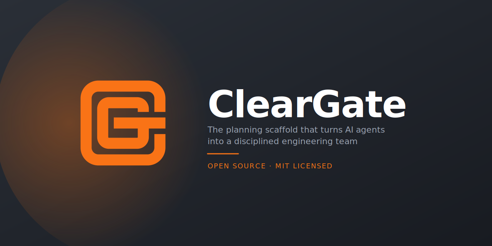
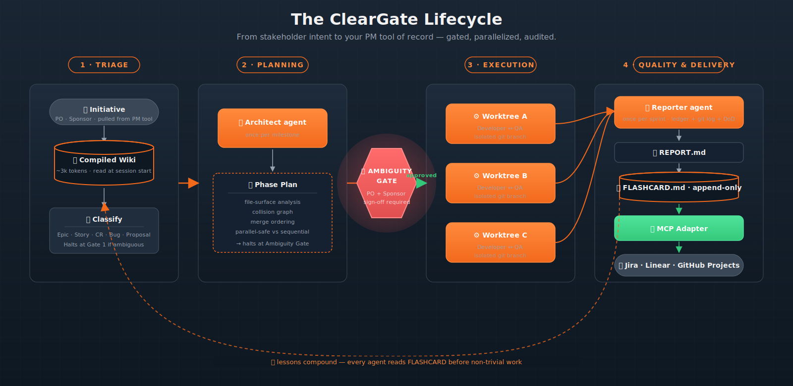

# ClearGate

**Bridging the gap between vibe coding and disciplined engineering.**

ClearGate is an open-source planning scaffold that turns AI coding agents into a disciplined engineering team. It installs a four-agent loop (Architect → Developer → QA → Reporter), a template-driven work-item protocol (proposals → epics → stories → sprints), and a compiled awareness wiki — so your AI agents stop drifting between disconnected tasks and start shipping coherent software.

> ClearGate is not an AI code generator. **It is an AI Engineering Manager.**

---

## Quick install

```bash
npx cleargate init
npx cleargate doctor
```

Requires Node ≥ 24 LTS. `init` writes a bounded ClearGate block into `CLAUDE.md`, installs the four-agent definitions, and scaffolds `.cleargate/`. To pin the version per-project, add it as a dev dependency: `npm i -D cleargate`. Full walkthrough in [Install](#install) and [Getting started in 10 minutes](#getting-started-in-10-minutes) below.

---

## The problem

Standard AI coding tools live entirely inside the developer's terminal. The business is locked out, sessions start blind, and agents re-grep raw files, hallucinate duplicate work, and overwrite cross-cutting decisions without warning.

|            | Standard AI                              | ClearGate                                                       |
| ---------- | ---------------------------------------- | --------------------------------------------------------------- |
| Context    | Session blindness, blind grep            | Compiled wiki (~3k-token `index.md` read at session start)      |
| Planning   | Flat task lists                          | Phase plans + shared-surface merge ordering                     |
| Execution  | Single terminal thread                   | Concurrent git worktrees + four-agent loop                      |
| Visibility | Dev-only (zero stakeholder visibility)   | MCP push to Jira / Linear / GitHub Projects                     |
| Memory     | Forgets between sessions                 | Append-only `FLASHCARD.md` lessons + sprint reports             |

---

## How it works



> Stakeholder input enters through Triage. The Architect drafts a phase plan, which **halts at the Ambiguity Gate** until human sign-off. Once approved, parallel Developer/QA pairs execute in isolated git worktrees. The Reporter synthesizes the sprint, lessons compound into the Wiki, and the MCP adapter pushes everything natively into your PM tool.

---

## What ClearGate does

### 1. Compiled awareness — the Karpathy-style wiki

Raw work-item state (epics, stories, sprints, bugs, CRs, proposals, flashcard lessons) is continuously compiled into a lightweight `.cleargate/wiki/index.md`. The orchestrator reads this ~3,000-token summary at the **start of every session** — instant grasp of project topology, active sprint goals, and architectural constraints, *before a single file is grepped*.

### 2. Triage → Planning → Execution → Quality & Delivery

Every change starts as a classified work item. Drafted Epics and Phase Plans **halt at the Ambiguity Gate** until an Orchestrator + PO + Sponsor sign-off unlocks them. The AI cannot skip levels or "go rogue" past Draft. The result: absolute business control over AI compute and repository changes.

### 3. The Four-Agent Loop

Sub-agents never converse. They communicate via structured, file-based artifacts routed by the orchestrator.

- **Architect** — once per milestone, writes a phase plan with file-surface analysis and merge ordering.
- **Developer** — once per story, in an isolated git worktree, implements code + unit tests and runs typecheck.
- **QA** — independently re-verifies against the story's Gherkin acceptance and DoD.
- **Reporter** — once per sprint, synthesizes the token ledger, flashcards, git log, and DoD into `REPORT.md`.

### 4. Shared-surface merge ordering

Before any code is written, the Architect lists the files each story will touch and computes the collision graph. Colliding stories enter a strict sequential queue; non-overlapping stories run concurrently in isolated git worktrees. No merge-conflict thrash, no file-lock contention, clean per-story commits.

### 5. Quality assurance & hotfix tracking

Final human sign-off is required before a sprint can close. Bugs found post-QA are **never** silently patched — they are filed as hotfixes with originating signal and files touched, giving full traceability. A strict lifecycle reconciler (`close_sprint.mjs`) blocks sprint close on any drift between shipped commits and ticket state.

### 6. Total visibility for the business — the MCP adapter

ClearGate runs an MCP server that exposes `cleargate_push_item`, `cleargate_pull_initiative`, and friends. Approved epics, stories, and sprint reports are pushed natively into the customer's tool of record — no middleman DB, no proprietary dashboard. Native adapters for **Jira, Linear, and GitHub Projects**. The Sponsor and PO audit AI-generated contracts, dependencies, and token ledgers in real time, in their own tool.

### 7. The self-improving engine

Every sprint feeds three input metrics into the next: first-pass success rate, Architect/QA bounce count, and the Bug-Fix Tax (% of sprint capacity spent on bugs). The Hotfix Audit asks *"could this hotfix have been a sprint story? why was it missed at planning?"* — and the lessons land in append-only `.cleargate/FLASHCARD.md`, tagged (`#schema`, `#auth`, `#worktree`, …) and read by every agent at the start of non-trivial work. The framework structurally forces the AI to learn from its mistakes — and from the human engineer's feedback.

---

## Install

Requires Node ≥ 24 LTS.

1. Bootstrap the scaffold in your repo:

   ```bash
   npx cleargate init
   ```

   `npx` fetches and runs the published package on demand — no prior install needed. The command writes a bounded `<!-- CLEARGATE:START -->...<!-- CLEARGATE:END -->` block into your `CLAUDE.md` (creating the file if it does not exist), installs agent role definitions under `.claude/agents/`, wires the token-ledger hook in `.claude/settings.json`, and creates `.cleargate/` with protocol rules, work-item templates, draft/archive folders, and a flashcard lesson log. Re-running `init` is idempotent — it updates the bounded block in place and preserves your customizations.

2. Verify the scaffold is healthy:

   ```bash
   npx cleargate doctor
   ```

   `doctor` checks for scaffold drift, missing hooks, blocked items, and configuration validity. Fix any issues it reports before starting your first sprint.

3. *(Optional)* Pin the version per-project so every contributor gets the same one:

   ```bash
   npm i -D cleargate
   ```

   Records `cleargate` under `devDependencies` in your `package.json`. Skip this step if you're happy letting `npx` always grab the latest published version.

---

## Getting started in 10 minutes

After `cleargate init` completes, ask Claude Code to begin. The session will read the ClearGate block in `CLAUDE.md` automatically. Walk through these steps:

1. **File a proposal.** Ask Claude Code: *"I want to add [feature]. File a ClearGate proposal."* Claude will classify the request, draft a Proposal file in `.cleargate/delivery/pending-sync/`, and halt at Gate 1 for your review.

2. **Approve it.** Read the draft. Set `approved: true` in the frontmatter and tell Claude Code to proceed. Gate 1 closes.

3. **Decompose into an Epic and Stories.** Claude Code will decompose the Proposal into an Epic (scope + goals) and then into Stories (individual implementable units). Each Story gets a Gherkin acceptance scenario and an ambiguity gate. If anything is unclear, the agent halts and asks — it cannot skip levels.

4. **Schedule a Sprint.** Group the Stories into a Sprint file. This tells the four-agent loop what to execute.

5. **Invoke the Architect subagent.** Ask Claude Code to spawn the Architect agent for Milestone 1. The Architect reads the Sprint file, produces a milestone plan, and assigns files to each Story. No production code is written at this step.

6. **Run the Developer, QA, and Reporter agents** for each Story in sequence. Each Developer agent commits exactly one Story; QA re-verifies independently; Reporter writes the retrospective at sprint end.

For gates configuration (what command `cleargate gate test` runs in your project), create `.cleargate/config.yml` at your repo root. `cleargate init` installs a documented example template at `.cleargate/config.example.yml` alongside — copy it and edit, or start from the skeleton below:

```yaml
# .cleargate/config.yml — adjust commands to your stack
gates:
  precommit: "npm run typecheck && npm test"   # Node example
  test: "npm test"
  typecheck: "npm run typecheck"
  lint: "npm run lint"
```

If a gate key is absent, `cleargate gate <name>` prints a friendly "not configured" message and exits 0 (non-blocking). Pass `--strict` to flip that to exit 1.

ClearGate is not a build tool, test runner, or CI system. The Developer agent calls *your project's* toolchain — `cleargate gate test`, `cleargate gate typecheck`, etc. — via the commands you configure in `.cleargate/config.yml`. Your toolchain stays yours; ClearGate orchestrates when and why agents invoke it.

---

## The new paradigm of team orchestration

- **The Product Owner** — gets disciplined backlog execution.
- **The Orchestrator** — codes at the speed of AI.
- **The Sponsor** — achieves total, real-time visibility.

**Ship faster. Ship disciplined. Ship with ClearGate.**

---

## Want to know more?

- Architecture, repo layout, and how ClearGate is built with itself: [docs/INTERNALS.md](./docs/INTERNALS.md)
- License: [LICENSE](./LICENSE) (MIT)
