This document describes how the ClearGate repo is organized and how we dogfood the framework against itself. If you're here to use ClearGate in your own project, start with [README.md](../README.md) instead.

---

# ClearGate

**ClearGate** gives Claude Code a disciplined ship-loop — proposals → epics → stories → sprints → four-agent execution (architect plans, developer codes, qa verifies, reporter retrospects). One command bootstraps a downstream repo:

```bash
npx cleargate init
```

Includes a Karpathy-style awareness wiki so every session starts with full situational context, not blind grep.

---

## What it is

A standalone framework that gives AI coding agents (Claude Code, Codex, etc.) disciplined structure for shipping software. ClearGate scaffolds the full lifecycle — every change starts as a Proposal, ratifies into an Epic, decomposes into Stories, gets scheduled into a Sprint, and runs through a four-agent loop (Architect plans, Developer codes, QA verifies, Reporter retrospects). A compiled wiki keeps every session aware of project state without re-deriving it from scratch.

What ClearGate is **not**: a build tool, CI runner, test runner, or deployment system. The Developer agent invokes *your project's* `npm test`, `cargo build`, `pytest`, etc. — ClearGate orchestrates when and why those run; the toolchain itself stays yours.

**Three concepts to know:**

- **The protocol** (`.cleargate/knowledge/cleargate-protocol.md`) — non-negotiable rules: classify every request before drafting, halt at gates, no orphan work items, file-based source of truth.
- **The four-agent loop** (`.claude/agents/{architect,developer,qa,reporter}.md`) — Architect plans a milestone, Developer ships one Story per commit, QA verifies independently, Reporter writes the sprint retrospective.
- **The Karpathy wiki** (`.cleargate/wiki/`) — compiled awareness layer derived from raw work items. Auto-rebuilds via PostToolUse hook on every Edit/Write to `.cleargate/delivery/`. Read at every session start in ~3k tokens.

## Quick start

In a target project where you want ClearGate-driven planning:

```bash
# One command — installs scaffold + bounded CLAUDE.md block + PostToolUse hook
npx cleargate init

# Build the wiki (no-op if delivery/ is empty; populates from existing items if any)
npx cleargate wiki build

# Query the wiki at triage time (read-only)
npx cleargate wiki query "<topic>"

# Validate consistency before approving / pushing items
npx cleargate wiki lint
```

After init, your repo gains:
- `CLAUDE.md` with a bounded `<!-- CLEARGATE:START -->...<!-- CLEARGATE:END -->` block (preserves your existing content)
- `.claude/agents/` with seven role definitions (four orchestration agents + three wiki subagents)
- `.claude/hooks/token-ledger.sh` and `.claude/settings.json` wiring (SubagentStop + PostToolUse)
- `.cleargate/{knowledge,templates,delivery,FLASHCARD.md}` for the protocol + work-item templates + draft/archive folders + lesson log

Re-running `cleargate init` is idempotent — updates the bounded block in place, preserves user customizations.

## How it works

```mermaid
flowchart LR
    Idea(["Vibe Coder<br/>'let's add X'"])

    subgraph PLAN [Plan]
        direction TB
        P["Proposal<br/>(Gate 1)"]
        E["Epic<br/>(Gate 2)"]
        S["Story<br/>(Gate 2)"]
        SP["Sprint"]
        P -->|approved: true| E
        E -->|ambiguity 🟢| S
        S --> SP
    end

    subgraph EXECUTE [Execute — four-agent loop]
        direction TB
        A["Architect<br/>plans milestone"]
        D["Developer<br/>codes / tests / commits"]
        Q["QA<br/>independent verify"]
        R["Reporter<br/>sprint retro"]
        A --> D
        D --> Q
        Q -.kickback.-> D
        Q -->|pass| R
    end

    subgraph DELIVER [Deliver]
        direction TB
        G3{"Gate 3<br/>push to PM?"}
        MCP["cleargate_push_item<br/>→ Linear / Jira / GitHub"]
        AR[("delivery/archive/<br/>+ remote_id")]
        G3 -->|yes| MCP
        MCP --> AR
    end

    W[(".cleargate/wiki/<br/>Karpathy awareness<br/>~3k tokens read at every<br/>session start")]

    Idea --> P
    SP --> A
    R --> G3
    P -.PostToolUse hook.-> W
    S -.PostToolUse hook.-> W
    AR -.PostToolUse hook.-> W
    W -.session-start read.-> Idea

    classDef gate fill:#fff3cd,stroke:#856404,color:#000
    classDef agent fill:#d1ecf1,stroke:#0c5460,color:#000
    classDef wiki fill:#e2e3e5,stroke:#383d41,color:#000
    class P,E,S,G3 gate
    class A,D,Q,R agent
    class W wiki
```



**Plan → Execute → Deliver** is the three-phase loop:

1. **Plan.** A vibe coder describes intent ("let's add OAuth"). Claude Code triages per the protocol, drafts a Proposal in `.cleargate/delivery/pending-sync/`, and halts at Gate 1 for human approval. Once approved, the Proposal decomposes into an Epic, then Stories. Each step has its own ambiguity gate; the AI cannot skip levels.

2. **Execute.** A Sprint groups Stories. The four-agent loop runs the Sprint: Architect produces one milestone plan, Developers implement one Story per commit (with tests + typecheck), QA verifies independently, Reporter writes the retrospective. The orchestrator (the conversational AI you're chatting with) dispatches; agents return structured text, never talk to each other directly.

3. **Deliver.** Approved items push to a remote PM tool (Linear, Jira, GitHub Projects) via the MCP adapter. The local `delivery/pending-sync/` is the source of truth — adapter is a thin push surface, never a custom database.

**Why a wiki?** Without compiled awareness, the AI starts every session blind: re-greps raw files, misses cross-references, drafts duplicate Proposals for work that already shipped. The wiki compiles raw state into `index.md` (~3k tokens) read at session start; per-item pages with backlinks; four synthesis pages (active sprint / open gates / product state / roadmap). Karpathy's pattern — query results file back to `wiki/topics/<slug>.md`, accumulating canonical answers over time.

**Read more:**
- Protocol rules: [`.cleargate/knowledge/cleargate-protocol.md`](.cleargate/knowledge/cleargate-protocol.md)
- Canonical scaffold (what `cleargate init` installs): [`cleargate-planning/`](cleargate-planning/)
- Active wiki: [`.cleargate/wiki/`](.cleargate/wiki/) (`index.md` is the entry point)
- Approved proposals: [`.cleargate/delivery/archive/PROPOSAL-*.md`](.cleargate/delivery/archive/)

---

## Repo layout

```
.cleargate/              ← raw work items + orchestration artifacts
  FLASHCARD.md          ← append-only lesson log (READ BEFORE WORK)
  knowledge/
    cleargate-protocol.md  ← delivery protocol (non-negotiable rules)
  templates/            ← blueprints: proposal/epic/story/CR/Bug/Sprint Plan
  delivery/
    INDEX.md            ← curated roadmap table (epic/sprint map)
    pending-sync/       ← drafts + in-flight items (sprints, epics, stories, proposals)
    archive/            ← items pushed to PM tool / completed
  wiki/                 ← compiled awareness layer
  sprint-runs/<id>/
    plans/M<N>.md       ← Architect output per milestone
    token-ledger.jsonl  ← auto-populated by SubagentStop hook
    REPORT.md           ← Reporter output at sprint end
  hook-log/             ← raw hook stdout/stderr

cleargate-planning/     ← canonical scaffold source (what `cleargate init` installs)
  CLAUDE.md             ← the injection spec
  .claude/{agents,skills,hooks,settings.json}
  .cleargate/{FLASHCARD.md,knowledge,templates,delivery,config.example.yml}/

cleargate-cli/          ← the `cleargate` npm package source
mcp/                    ← MCP server (nested separate git repo)
admin/                  ← admin tooling stub

.claude/                ← LIVE dogfood instance (gitignored) — Claude Code reads here
  agents/               ← four-agent role definitions + wiki subagents
  skills/flashcard/
  hooks/*.sh
  settings.json
```

## Stack versions (this repo's own)

Node 24 LTS · TypeScript ^5.8 · Fastify ^5.8 · Drizzle 0.45.2 · Zod ^4.3 · Postgres 18 · Redis 8 · SvelteKit ^2 (Svelte 5) · Tailwind ^4.2 · DaisyUI ^5.5.

Note: ClearGate imposes none of these on downstream consumers. This list documents the meta-repo's own toolchain; downstream projects pick whatever stack they run and configure gate commands via `.cleargate/config.yml` accordingly.

---

## Status

ClearGate is at **v0.1-alpha** (not yet on npm — manual publish pending). The framework is dogfooded against itself: this repo's planning lives in `.cleargate/delivery/`, executed through the same four-agent loop the framework ships.

## License

MIT — see [LICENSE](../LICENSE).
